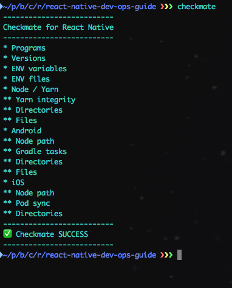
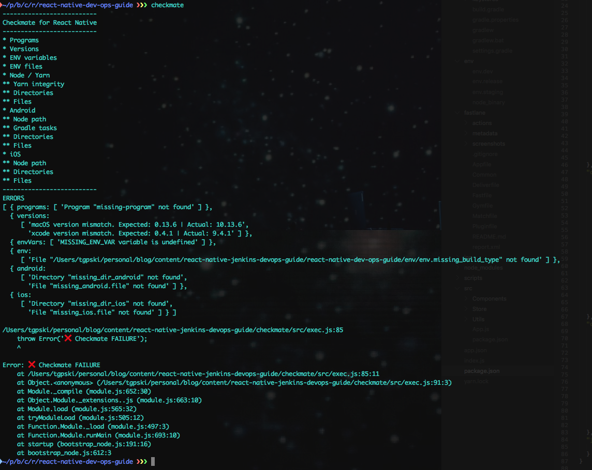

# Checkmate for React Native

Checkmate is a environment validation tool for React Native projects. Increase your build success rate among multiple collaborators and CI servers. Catch build configuration errors at the start of the build, instead of 95% through.

* Run checkmate as a standalone command. `checkmate` in your React Native project root directory.



* Run checkmate as part of your Fastfile. Use the yarn plugin as follows:

```
  yarn(
    command: 'install',
    package_path: './package.json'
  )
  yarn(
    command: 'checkmate',
    package_path: './package.json'
  )
```

# Install

`yarn -D add react-native-checkmate`

# Configure

Add a `checkmate` key and configuration object to your `package.json` file.

# package.json example

```json
{
  "checkmate": {
    "verbose": false,
    "shellPath": "/bin/zsh",
    "silentShell": true,
    "programs": ["fastlane", "gem", "pod", "react-native", "badge"],
    "versions": {
      "macOS": "10.12.6",
      "node": "v8.11.3",
      "ruby": "2.3.1p112",
      "xcode": "9.2",
      "yarn": "1.7.0",
      "npm": "5.6.0"
    },
    "envVars": ["ANDROID_SDK", "ANDROID_SDK_TOOLS", "ANDROID_PLATFORM_TOOLS"],
    "env": {
      "dir": "env",
      "buildTypes": ["dev", "staging", "release"]
    },
    "node": {
      "yarnIntegrity": true,
      "dirs": ["node_modules"],
      "files": ["yarn.lock"]
    },
    "android": {
      "nodePath": true,
      "gradle": true,
      "dirs": ["android"],
      "files": ["my-release-key.keystore"]
    },
    "ios": {
      "nodePath": true,
      "nodePathDir": "env",
      "nodePathFilename": "node_binary",
      "pods": true,
      "dirs": ["ios"],
      "files": []
    },
    "other": {
      "dirs": [],
      "files": []
    }
  },
}
```

# Error example



# Options Reference

## Configuration

### verbose (boolean)

console.log checkmate configuration object + all shell output

### shellPath (string)

checkmate expects a bash or similar shell (bash, zsh, etc.). shelljs by default uses /bin/sh. String path to bash or zsh executable.

### silentShell (boolean)

show / hide shell output

## Challenges

### programs (string array)

executable program names as strings

### versions (object)

Supported software & expected format for version string:

* macOS: "10.13.6"
* node: "v8.11.3"
* ruby: "2.3.1p112"
* xcode: "9.4.1"
* yarn: "1.7.0"
* npm: "6.1.0"

_Commands_

* macOS  <br/> `sw_vers | grep "ProductVersion" | awk '{print $2}'`
* node <br/> `node --version`
* ruby <br/> `ruby --version | awk '{print $2}'`
* xcode <br/> `xcodebuild -version | grep 'Xcode' | awk '{print $2}'`
* yarn <br/> `yarn --version`
* npm <br/> `npm --version`

### envVars (string array)

Validates exported environment variables, i.e. 'ANDROID_SDK_TOOLS'. Performs directory validation on env var values.

### env

Validates environment files stored in $PROJECT_ROOT/$dir/env.[...buildTypes]

* __dir (string)__ <br/> Environment files directory relative to $PROJECT_ROOT

* __buildTypes (string array)__ <br/>Array of build types, i.e. ['dev', 'staging', 'release'].<br>Maps to -><br/>```
$PROJECT_ROOT/$dir/env.dev
$PROJECT_ROOT/$dir/env.staging
$PROJECT_ROOT/$dir/env.release
```

### node

Validates yarn integrity, and custom dirs / files related to node / npm / yarn.

* __yarnIntegrity (boolean)__ <br/> Perform a yarn integrity check on node_modules folder vs yarn.lock
* __dirs (string array)__ <br/> Verify presence of directories, relative to $PROJECT_ROOT
* __files (string array)__ <br/> Verify presence of files, relative to $PROJECT_ROOT

### android

Validates custom node path parameter, gradle tasks, and custom dirs / files related to Android.

* __nodePath (boolean)__ <br/>
* __gradle (boolean)__ <br/> Verifies all gradle tasks are runnable. Downloads missing dependencies if necessary.
* __dirs (string array)__ <br/> Verify presence of directories, relative to $PROJECT_ROOT/android
* __files (string array)__ <br/> Verify presence of files, relative to $PROJECT_ROOT/android

### ios

Validates custom node path parameter, gradle tasks, and custom dirs / files related to Android.

* __nodePath (boolean)__ <br/>
* __nodePathDir (string)__ <br/>
* __nodePathFilename (string)__ <br/>
* __pods (boolean)__ <br/> Ensures podfile.lock and Pods/manifest.lock are equivalent
* __dirs (string array)__ <br/> Verify presence of directories, relative to $PROJECT_ROOT/ios
* __files (string array)__ <br/> Verify presence of files, relative to $PROJECT_ROOT/ios

### other

* __dirs (string array)__ <br/> Verify presence of directories, relative to $PROJECT_ROOT
* __files (string array)__ <br/> Verify presence of files, relative to $PROJECT_ROOT

# Module Usage

Checkmate also exposes all validators in the root module. Import any of the sub-modules individually for custom validators. See `./src/[module name].js` for usage information.


```
module.exports = {
  general: {
    dirCheck,
    dirsCheck,
    fileCheck,
    filesCheck,
    programCheck,
    programsCheck
  },
  versions: {
    versionsCheck
  },
  node: {
    yarnIntegrityCheck,
    nodePathCheck
  },
  ios: {
    iosPodCheck
  },
  android: {
    gradleTasksCheck
  },
  env: {
    envVarsCheck
  }
};
```


